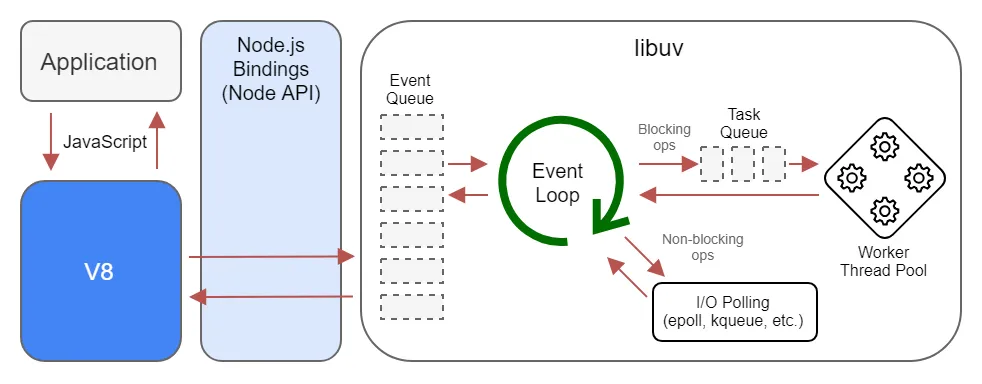

# Node Thread Pool

Node.js performance tuning involves optimizing various aspects of a Node.js application to make it run faster, use fewer resources, or handle more users simultaneously. This can include adjustments at the code level, such as optimizing algorithms and database queries, as well as configuration tweaks like tuning the size of the `libuv thread pool`. The goal is to make the application more efficient, responsive, and scalable.

## libuv

libuv is a multi-platform C library that provides support for asynchronous I/O-based operations such as file system tasks, networking (which is designed around non-blocking event loops), and even name resolution. It's a crucial part of Node.js's runtime, allowing it to handle numerous simultaneous connections efficiently in a `single-threaded` event loop.



### libuv thread pool

The libuv thread pool is a fixed-size thread pool that libuv uses to offload operations that are potentially blocking, thereby ensuring that the main event loop is not blocked. This pool is particularly useful for handling operations that are I/O-bound or CPU-bound but cannot be processed in a non-blocking way due to system-level constraints. These operations include, but are not limited to:

#### UV_THREADPOOL_SIZE

The UV_THREADPOOL_SIZE environment variable in Node.js controls the number of worker threads available in libuv's thread pool, which is used by Node.js to handle asynchronous tasks in the background. These tasks can include file I/O, DNS queries, and certain types of network operations. By default, the size of this thread pool is 4.

Tuning the UV_THREADPOOL_SIZE can have an impact on the performance of your Node.js application, but the optimal value depends on various factors such as the workload, the number of CPU cores, and the nature of the I/O operations your application performs.

## Example

#### How to Test

Example 1:

```sh
# Reading two files concurrently
node src/read-files.js
```

Example 2:

```sh

# Fetching data from multiple APIs concurrently
node src/fetch-data-from-apis.js

# Test
curl http://localhost:3000/api/data
```
